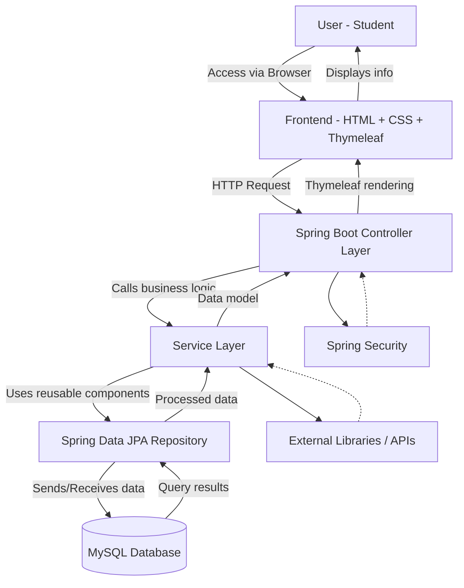

# Campus Restaurant Recommendation System 🍔🎓

## 📌 Overview

A JavaFX-based application that recommends restaurant for campus students
based on their preferences adn location.
This project demonstrates clean architecture (DAO, Service, Presentation layers)
and can be extended into a full recommendation engine.

## Notes

- Scope of F&B from our school and filter out one or two restaurants.  (look from Meituan)
- Build using Java - website
- Instead of exact keyword search, use **NLP** to handle natural language.
    - Example: A user types *“cheap spicy noodles near dorm”* → system extracts *[cheap, spicy, noodles, location: dorm]*.
- Tools: Simple keyword extraction in Java (Stanford NLP) or pretrained models.

## 🚀 Features

- View meals with images
- Search and filter meals
    - Database includes: Price + distance + rating + cuisine preference + name +operating hour+location
    - Filter results include first choice +second choice+...n choice(if have)
- (Planned) Ratings & feedback
- Show the location on the school map and
- Calculate the distance between the user and the restaurant
- Login + encryption
- Error handling
- Favourite restaurant section - allow users to favourite restaurants, use that knowledge for suggesting restaurants as well.  
- Reviews - photo uploading + 5 star + different tags?

## 🛠 Tech Stack

- Java + HTML + CSS

https://docs.google.com/spreadsheets/d/17r_xPepRlxEt0EHtHF6j41vOq48ZuWlwJfK1ky5iqYY/edit?usp=sharing

# Essential attributes of good software

### 1. Maintainability

- System is built using Spring Boot + Thymeleaf + JPA, already follows a modular, layered structure (Controller → Service → Repository). This makes it easy to add and remove functionality from each part of the program without being detrimental to other parts of the program.
- Each module (e.g. restaurant filtering, favourites, login) can be updated or replaced without breaking the rest of the system.
- If the school adds new restaurants, you only update the database table or add new filter logic - no need to rebuild the whole app

### **2. Dependability and Security**

- **Dependability:** app must reliably return correct restaurant data and never crash during searches or logins.
- **Security:** Using **Spring Security** with password encryption prevents unauthorized access to accounts or restaurant dashboards.
- Prevent malicious actions such as forged reviews, fake ratings, or SQL injection by validating user input and restricting admin endpoints.
- **Safety:** The system’s failure (e.g., downtime) causes no physical or financial harm—it only delays a recommendation, not money loss.

### **3. Efficiency**

- Hao Chi’s recommendations and filters must load fast even on average student Wi-Fi or mobile hotspots.
- You minimize queries by using **indexed database fields** (price, distance) and **JPA query optimization**.
- Efficient use of resources ensures a smooth user experience on low-end laptops or phones.

### **4. Acceptability**

- Designed for students, so the interface is **simple, clean, and ad-free**—no clutter.
- Text labels and buttons use **plain language** (e.g., “Top 3 choices,” “Waimai Price”) rather than technical jargon.
- Works on browsers commonly used in China (Chrome, Edge, QQ Browser).

# Software engineering ehtics

### **1. Confidentiality**

- Students must trust that their personal information (login, location, favorites) is not leaked.
- You’ll show a **Terms & Conditions** screen where users agree to how their data is used (for recommendations).
- Database access should be limited; only authorized admins can view analytics.

### **2. Competence**

- You built the system using **Spring Boot + Thymeleaf + MySQL**, which fits your course scope — you’re not claiming to deliver a large-scale production system.
- When explaining future plans (e.g., deep-learning review analysis), you clarify that they’re **planned** and not yet implemented, avoiding false claims.

### **3. Intellectual Property Rights**

- Attribute any external code or tutorial snippets (e.g., from the YouTube login guide).

### **4. Computer Misuse**

- No scraping or hacking competitor data.
- Do not collect sensitive student info beyond what’s required for recommendations.
- Prevent SQL injection or XSS that could damage servers or reveal data.

# Application is build according to the IEEE Code of Ethics

1. **PUBLIC** - Software engineers shall act consistently with the public interest.
2. **CLIENT AND EMPLOYER** - Software engineers shall act in a manner that is in the best interests of their client and employer consistent with the public interest.
3. **PRODUCT** - Software engineers shall ensure that their products and related modifications meet the highest professional standards possible.
4. **JUDGMENT** - Software engineers shall maintain integrity and independence in their professional judgment.
5. **MANAGEMENT** - Software engineering managers and leaders shall subscribe to and promote an ethical approach to the management of software development and maintenance.
6. **PROFESSION** - Software engineers shall advance the integrity and reputation of the profession consistent with the public interest.
7. **COLLEAGUES** - Software engineers shall be fair to and supportive of their colleagues.
8. **SELF** - Software engineers shall participate in lifelong learning regarding the practice of their profession and shall promote an ethical approach to the practice of the profession.

# Software process model chosen - Integration and configuration

### **How it fits our project**

好吃 is not built entirely from scratch; it **reuses and integrates existing frameworks, libraries, and tools** to save time and reduce risk.

Our development mainly focuses on configuring these existing components to meet student-specific requirements.

---

### **1. Based on software reuse**

- We reuse well-tested frameworks rather than writing every feature ourselves.
- **Examples:**
    - **Spring Boot** → provides the base structure for controllers, dependency injection, and configuration.
    - **Thymeleaf** → ready-made HTML templating engine integrated into Spring.
    - **Spring Security** → existing authentication and encryption module.
    - **MySQL + JPA** → pre-built persistence layer handling database queries automatically.

### **2. Configuration for user requirements**

Each reused component is **configured** to suit our project context — the Wuhan University campus and student users.

- Example configurations:
    - Spring Security customized to include **student login roles**.
    - Database schema configured with **restaurant, rating, price, and location** tables.
    - Thymeleaf templates customized to display campus-style restaurant cards and filters.
    - JPA configured to handle **search and filter queries** (price, distance, spice level).

### **3. Advantages (Good)**

- **Reduced cost & risk:** frameworks are battle-tested; we avoid low-level bugs.
- **Faster delivery:** we can focus on logic (recommendation, filters) instead of re-inventing infrastructure.
- **Stable base:** Spring ecosystem ensures long-term maintenance.

### **4. Disadvantages (Bad) - Maybe we don’t have to include this**

- **Requirement compromises:** frameworks limit customization.
    - Example: Spring Security’s default login flow may restrict UI flexibility.
- **Loss of control:** updates or deprecations from libraries (e.g., Thymeleaf changes) might break compatibility.
- **Dependence on others’ architecture:** future changes must fit within the Spring structure.

# Four basic process activities

### Software specification

## **1. Requirements Elicitation and Analysis**

> What do the system stakeholders require or expect from the system?
> 

**Stakeholders:**

- **Students:** want fast, clear, ad-free meal suggestions.
- **Developers:** need a maintainable structure using Spring Boot and MySQL.
- **Administrators:** require easy database updates when menus or prices change.

**Elicitation methods:**

- Informal **interviews** with classmates to find pain points in Meituan/Ele.me.
- **Observation** of how students pick meals—scrolling endlessly, then giving up.
- **Brainstorming** features that solve these frustrations (clear prices, shortlists, tags).

**Analysis results:**

The core problem was *too many irrelevant choices*.

Therefore, the system must **filter and rank** restaurants to show only the most relevant campus options.

---

### **2. Requirements Specification**

> Defining the requirements in detail
> 

After elicitation, the requirements were written formally as **functional** and **non-functional** items.

**Examples:**

- *Functional:*
    - The system shall allow users to log in and store encrypted passwords.
    - The system shall display a list of restaurants within 1 km.
    - The system shall generate the top 3 restaurant recommendations.
- *Non-functional:*
    - The system shall respond to queries within 3 seconds.
    - The system shall ensure 24/7 data security.
    - The interface shall be minimalist and mobile-friendly.

These specifications form the baseline for coding and testing.

---

### **3. Requirements Validation**

> Checking the validity of the requirements
> 

Validation ensured the documented requirements accurately reflected stakeholder needs and were feasible.

We performed:

- **Peer reviews:** classmates tested the prototype and confirmed the filters matched their expectations.
- **Consistency check:** verified that recommendation logic matched database filters.
- **Feasibility check:** confirmed all planned functions could be implemented with Spring Boot + MySQL + Thymeleaf.

Result: all essential features were achievable within the semester timeline, with advanced features (e.g., NLP search) reserved for future iterations.

# Software design and implementation

### **1. Architectural Design**

### **Explanation**

- **User → Frontend (Thymeleaf):** Students interact with the app via web pages rendered by Thymeleaf.
- **Controller Layer:** Handles requests like “filter restaurants” or “add favorite.”
- **Service Layer:** Contains logic — applies filters, calculates distance, and manages recommendations.
- **Repository Layer (Spring Data JPA):** Talks to **MySQL** to store and fetch data.
- **Spring Security:** Secures login, authentication, and password handling.
- **External Libraries/APIs:** Future extensions (e.g., map distance API, image upload services).

---

### **2. Database Design (To be updated by Ken)**

The database stores restaurant and user information in a structured, relational format using **MySQL**.

**Main Tables**

| Table | Key Fields | Purpose |
| --- | --- | --- |
| **Users** | user_id, username, password (encrypted) | Authentication and personalization |
| **Restaurants** | restaurant_id, name, price_eatin, price_waimai, distance, tags | Core restaurant data |
| **Favorites** | favorite_id, user_id (FK), restaurant_id (FK) | Track users’ saved restaurants |
| **Reviews (Future)** | review_id, user_id, restaurant_id, rating, comment, photo path | Stores feedback and photos |

Relationships are defined through foreign keys so that one user can favorite many restaurants and each restaurant can have many reviews.

---

### **3. Interface Design (To be updated by everyone who’s doing their respective tasks)**

Interface design focuses on how system components and users interact.

- **System Interfaces:**
    - Controllers call Services through clearly defined Java interfaces.
    - Services communicate with Repositories via Spring Data JPA methods (e.g., `findByPriceLessThan()`).
- **User Interface:**
    - Implemented with **Thymeleaf templates**, styled using HTML + CSS.
    - Pages: *Login*, *Sign Up*, *Home (Restaurant List)*, *Favorites*, *Top 3 Recommendations*.
    - Clean, ad-free layout with buttons and filters students easily recognize.

---

### **4. Component Selection and Design**

Following the **Integration and Configuration** model, *好吃* reuses proven components rather than developing them from scratch:

| Component | Source | Purpose |
| --- | --- | --- |
| **Spring Boot** | Framework | Provides web server, configuration, and routing |
| **Thymeleaf** | Template engine | Dynamically renders restaurant data on HTML pages |
| **Spring Security** | Library | Handles authentication and password encryption |
| **Spring Data JPA** | ORM framework | Simplifies database access |
| **MySQL** | Database | Stores persistent information |

Each component was **configured** for campus requirements—for example, login restricted to student accounts and restaurant data filtered to within 1 km of campus.

---

### **5. Implementation**

Implementation translates the design into an **executable Java application**.

Steps performed:

1. **Coding:** Controllers, service classes, and repository interfaces written in Java.
2. **Template integration:** Thymeleaf linked to Spring Boot controllers for data display.
3. **Database connection:** MySQL integrated via JPA; data seeded with ~20 sample restaurants.
4. **Debugging:** Continuous testing after each feature—login, filter, favorites—to ensure smooth operation.
5. **Version Control:** Git used to manage iterations and bug fixes.

Design and implementation were **interleaved**; whenever a bug or UI limitation appeared, small redesigns (e.g., adding a new method or adjusting the database schema) were done immediately.

### **Changing Requirements**

As we discussed and tested early prototypes, several requirements changed or became clearer:

- Login and sign-up were upgraded from a simple local form to a **secure Spring Security module** after feedback on privacy.
- The recommendation feature shifted focus from a random “Top 3” to a **filter-based ranking system** reflecting budget and distance.
- A future plan for **photo reviews** emerged after users said they rely on food pictures.
    
    These changes illustrate that requirements are not fixed; they evolve with user feedback and technical feasibility.
    

---

### **Coping with Change**

Our team applied **incremental development** to manage evolving requirements efficiently.

Instead of trying to build the entire platform in one release, we divided work into **small, testable increments**.

Each increment delivered a specific portion of functionality and was reviewed collectively by the team.

---

### **Incremental Delivery in Practice**

| **Increment** | **Main Functionality Delivered** | **Group Review Outcome** |
| --- | --- | --- |
| 1 | Login + Sign-Up (basic Spring Boot pages) | Verified account creation flow |
| 2 | Restaurant List + Filtering | Tested filtering accuracy, adjusted layout |
| 3 | Favorites System | Confirmed database links between users and restaurants |
| 4 | Top 3 Recommendation Button | Tuned algorithm for relevance |
| 5 | UI Refinement + Seed Data | Final polish before demo |
| *Planned Next* | Reviews + Photo Upload | To be added after presentation |

Each increment was deployed locally, demonstrated to the group, and modified based on peer comments before the next feature was started.

---

### **Prioritization of Requirements**

We followed a **priority-first strategy** — implementing the most critical requirements early:

1. **Core usability features:** login, list display, filtering.
2. **Personalization features:** favorites, top 3 recommendations.
3. **Enhancement features:** reviews, photos, analytics (future).

By focusing on high-impact functionality first, we ensured that even partial versions of *好吃* remained usable and demonstrable.

# Requirement Engineering

**User Requirements**

- The user should be able to log in securely using a student account.
- The user should be able to view a list of campus restaurants with images, tags, and prices.
- The user should be able to filter restaurants by price, distance, or food type.
- The system should show the Top 3 restaurant recommendations based on user filters or favorites.
- The user should be able to favourite and unfavourite restaurants.
- The interface should be simple, ad-free, and mobile-friendly.

**System Requirements**

- The system shall authenticate users using Spring Security with encrypted passwords.
- The system shall store restaurant data (name, price, distance, tag, rating) in a MySQL database.
- The system shall process user input filters and return matching restaurants using JPA queries.
- The system shall display Eat-in and Waimai prices side by side on each restaurant card.
- The system shall allow users to mark favorites stored in a Favorites table linked to user IDs.
- The system shall generate and display Top 3 restaurants based on preferences and distance.
- The system shall complete all search and filter operations in under 3 seconds.

---

**System Stakeholders**

| Stakeholder | Role / Interest |
| --- | --- |
| Students | End users who search and filter restaurants. |
| Administrators | Manage restaurant data, update prices and tags. |
| Developers | Build, test, and maintain the system. |
| University | Ensures compliance with privacy and performance standards. |
| Restaurant Owners (Future) | May use analytics data for business insights. |

---

**Functional Requirements**

1. The system shall allow users to register and log in.
2. The system shall display restaurants within the defined campus area.
3. The system shall allow users to apply filters (price, tags, distance).
4. The system shall calculate and display walking distance.
5. The system shall allow users to favourite and unfavourite restaurants.
6. The system shall generate a Top 3 recommendation list.
7. The system shall allow administrators to add or update restaurant data.

**Non-Functional Requirements**

| Property | Requirement | Measurement / Metric |
| --- | --- | --- |
| **Speed** | The system must load restaurant data and filters quickly to maintain responsiveness for users. | Average response time ≤ 3 seconds per query; screen refresh time ≤ 1 second. |
| **Size** | The system must use minimal storage while maintaining efficient performance. | Total project size ≤ 100 MB including MySQL database; database entries ≤ 20 restaurants for testing. |
| **Ease of Use** | The interface must be intuitive for students to navigate without prior training. | Average training time ≤ 5 minutes; one help section per major feature (login, filter, favorites). |
| **Reliability** | The system must remain operational and available during usage periods. | Mean time to failure ≥ 48 hours; probability of unavailability ≤ 5%; availability ≥ 95%. |
| **Robustness** | The system must recover smoothly from unexpected errors or failed connections. | Time to restart after failure ≤ 10 seconds; data corruption probability = 0%; all failed operations logged automatically. |
| **Portability** | The system must operate consistently across major browsers and environments. | Tested on Chrome, Edge, and QQ Browser; percentage of target-dependent code ≤ 10%; compatible with both Windows and macOS systems. |

# **Requirements Engineering Processes**

Requirements engineering in *好吃 (Campus Restaurant Recommendation System)* is an iterative activity that includes elicitation, analysis, validation, and management. These processes are interleaved throughout the development cycle to ensure that the system continues to meet student needs as they evolve.

---

**Requirements Elicitation**

Stakeholders sometimes find it difficult to clearly express what they want or use different terms to describe similar needs. To address this, the team engaged in multiple discussions to clarify expectations and resolve conflicts in priorities.

**Common Challenges**

- Stakeholders were initially uncertain about specific features they wanted.
- Some expressed needs in general terms, such as “make it simpler to choose food.”
- Conflicts arose between design simplicity and additional feature requests.
- Organizational factors, like privacy considerations, influenced the inclusion of a secure login.
- Requirements evolved as new ideas, such as photo reviews, emerged during development.

**Elicitation Stages**

1. **Requirements Discovery** – Conducted informal conversations with students to identify pain points with current apps like Meituan and Ele.me, focusing on cluttered UI and hidden prices.
2. **Requirements Classification and Organization** – Grouped the gathered requirements into categories: core functions (login, list, filters), personalization (favorites, top 3), and future features (reviews, map integration).
3. **Prioritization and Negotiation** – Prioritized features based on importance and feasibility, implementing the highest-impact features first (login, filtering, favorites).
4. **Requirements Specification** – Documented final requirements in tabular format for reference and passed them into the design phase.

---

**Requirements Analysis**

Requirements were analyzed to ensure clarity, consistency, and feasibility. Redundant or overlapping features were merged, and conflicting requests were resolved through group discussion. The system’s main focus was defined as fast, accurate, and personalized restaurant recommendations for students.

---

**Requirements Validation**

Requirements were validated through peer testing and walkthroughs. Early prototypes were demonstrated to classmates to confirm whether each feature met expectations. Feedback led to refining the filter system, UI layout, and top 3 recommendation logic to ensure alignment with user needs.

---

**Requirements Management**

Requirements were continuously reviewed and updated during the project. New features or changes were tracked in a shared document and assigned priority levels for later implementation. Each modification was logged to maintain traceability between requirements and implemented functions. Version control (Git) ensured that evolving requirements were properly reflected in updated code iterations.

---

**Requirements Validation**

Validation ensures that all documented requirements for *好吃 (Campus Restaurant Recommendation System)* accurately reflect user needs and can be realistically implemented. Because requirement errors can lead to major rework, validation was treated as a critical stage of development.

**Validity**

The system provides functions that directly support student needs, such as quick restaurant search, clear price comparison, and top 3 recommendations. All implemented features were reviewed to confirm they align with the project’s goal of helping students decide where to eat efficiently.

**Consistency**

Requirements were checked for internal conflicts. Filters, recommendation logic, and favorites were tested together to confirm that no functions contradicted each other. For example, applying filters still returns accurate Top 3 results, and favorites remain consistent across sessions.

**Completeness**

All essential functions identified during elicitation were included: login, view list, filter, top 3, and favorites. Planned future features like reviews and group planning were documented for later phases to maintain project completeness while keeping scope realistic.

**Realism**

Each requirement was evaluated against available time, team skill level, and technology. All confirmed features were achievable within the semester using Spring Boot, Thymeleaf, and MySQL, ensuring that implementation stayed within budget and capability limits.

**Verifiability**

Every requirement was written so it could be tested or measured. Examples include verifying login success, measuring system response time, and confirming database updates after favorites are saved. Functional testing and peer feedback sessions confirmed that the implemented requirements behaved as expected.

---

**Requirements Change**

Changes to requirements were tracked systematically throughout the project. Each new idea or modification was recorded with its reason, implementation priority, and related system components. Dependencies between requirements were documented so that any change in one function—such as adding a photo review feature—could be assessed for its impact on others. All change proposals were reviewed as a group before being linked to new development iterations. This process ensured controlled and traceable evolution of requirements in *好吃*.
